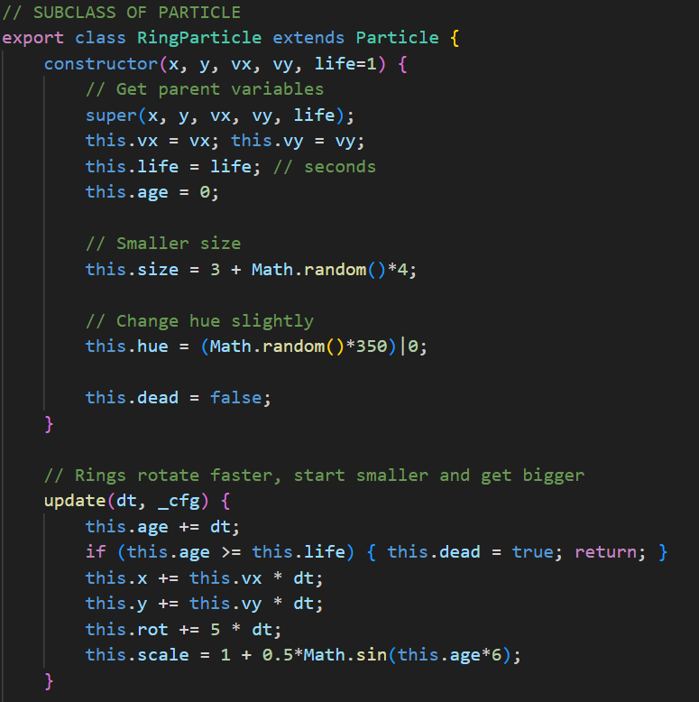
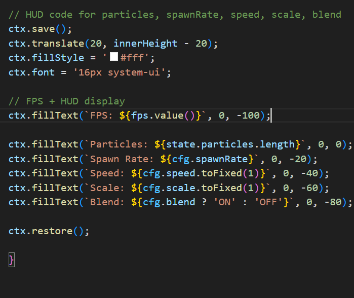

# Orbit Painter (Canvas + Modules + Classes + Closures)

# SEBASTIAN MAIN
All these files use the ES6 import and export because main.js imports and puts them all together.
Each file has it's own responsibility so therefore they fit the requirements for modules. For classes and inheritence, I created the 'RingParticle' that extends 'Particle' and has its own unqiue shape (circle) with it's own size and colors. Closures were implemented in the makeFPSMeter function where private variables (frames, time, frameCounter) were initalized and returned by the tick or value statements. Finally, transforms were used mainly for the emitter head pulse effect. Where the header size is determined by a SIN math function and then applied in a smooth transition. Addtionally, the HUD elements were added by translating the elements to the bottom left of the page.

## Purpose
Build a modular Canvas app demonstrating:
- ES Modules (`import`/`export`)
- Classes with inheritance (`Sprite` → `Particle`, `Emitter`)
- A closure with private state (`makeSettings`)
- Canvas transforms (`save/restore`, `translate`, `rotate`, `scale`) and animation (`requestAnimationFrame`)

## Quick Start
1. **Use a local server** (modules do not load from `file://`).
- Option A: VS Code Live Server.
- Option B: `npx http-server -p 8080` at project root, then open `http://localhost:8080`.(not recommended)
2. Open the browser console for errors.
3. Resize your window to test DPR-aware sizing.

## Controls
- **Space**: Pause/Resume
- **←/→**: Decrease/Increase orbit speed
- **↑/↓**: Decrease/Increase scale
- **B**: Toggle blend mode (`lighter` vs `source-over`)

## Your Tasks (checklist)
- [X] Implement at least **one additional particle shape** or drawing effect. (`sprites.js`, `renderer.js`)

- RingParticle

- [X] Add **one new interaction** (e.g., key to clear canvas, change color scheme). (`main.js`, `renderer.js`)

- Clear particles (c)

- [X] Implement **at least one new transform usage** (e.g., scaled ring, rotated HUD element).(`renderer.js`)

- Did pulsing emitter head in renderer.js

- [X] Make a **closure-backed utility** (e.g., seeded RNG or FPS meter) separate from classes. (`engine.js` or `settings.js` or a new file)

- [X] Ensure **resource cleanup** (particle culling, clamp dt). (`main.js`, `sprites.js`)
- [X] Comment where you met each rubric line.

## Where to Work (TODO map)
- `src/sprites.js`: search for `TODO[Student]` → add new particle shape or subclass; tweak physics.
- `src/renderer.js`: search for `TODO[Student]` → add transforms/graphics, optional HUD, clear modes.
- `src/settings.js`: search for `TODO[Student]` → extend closure settings (color themes, spawn rate).
- `src/main.js`: search for `TODO[Student]` → add new controls and behaviors.
- `src/engine.js`: optional `TODO[Student]` → add FPS meter using a closure.

## Submission
- Zip the project (include `README.md`).
- Include a short paragraph at the top of `README.md` describing where you implemented **modules, classes/inheritance, closures**, and **transforms**.
- Provide 1–2 screenshots.

## Rubric (100 pts)
- Modules: 15
- Classes + inheritance: 25
- Closure with real use: 15
- Canvas transforms + `save/restore`: 15
- Animation loop + lifecycle: 15
- Interaction: 10
- Organization/Comments: 5
**Extra credit (+10)**: trail compositing variants, screenshot export, collision splash.

## Academic Honesty
Write your own code. Cite any references. You may discuss ideas but not share code.